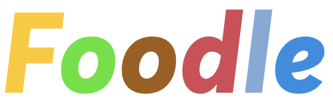

# Foodle - Your Personalized Food and Recipe App



[](https://opensource.org/licenses/MIT)

Welcome to Foodle, your personalized food and recipe app! With Foodle, you can discover new recipes, save your favorites, and share them with your friends. Our app is designed to cater to your specific dietary needs and preferences, making it easier than ever to enjoy delicious meals at home.

Visit our live app: [Foodle Web App](https://foodle.example.com)

**Table of Contents**

- [Features](#features)
- [Installation](#installation)
- [Getting Started](#getting-started)
- [Contributing](#contributing)
- [License](#license)

## Features

- **Browse Recipes:** Explore a variety of recipes from different cuisines, tailored to your dietary preferences and restrictions.
- **Personalized Recommendations:** Receive personalized recipe recommendations based on your taste preferences, dietary restrictions, and favorite ingredients.
- **Save & Organize:** Save your favorite recipes, and organize them into collections for easy access.
- **Shopping List:** Automatically generate shopping lists for recipes, making grocery shopping a breeze.
- **Responsive Design:** Foodle is fully responsive, ensuring a great experience on desktop devices.

## Installation

To get Foodle up and running locally, you will need to clone the frontend repository and follow the steps below:

1. **Clone the repository**

```bash
git clone https://github.com/dzy5075/final-project-Foodle-frontend.git
```

2. **Navigate to the project directory**

```bash
cd final-project-Foodle-frontend
```

3. **Install dependencies**

```bash
npm install
```

4. **Start the development server**

```bash
npm start
```

The app should now be running at `http://localhost:3000/`.

Please note that Foodle's frontend is built using React and requires a backend API for full functionality. You can find the backend repository [here](https://github.com/dzy5075/final-project-Foodle-backend).

## Getting Started

1. **Register an account:** Create a free Foodle account by providing your email, username, and password.
2. **Set your preferences:** Complete your user profile by specifying dietary preferences, restrictions, and favorite ingredients.
3. **Browse recipes:** Explore recipes and get personalized recommendations based on your preferences.
4. **Save & Organize:** Add recipes to your favorites, and create collections to keep your recipes organized.
5. **Share the love:** Share your favorite recipes with your friends and family using the built-in sharing options.

## Contributing

We welcome contributions to Foodle! If you would like to contribute, please follow these steps:

1. Fork the project repository.
2. Create a new branch for your feature or bugfix.
3. Commit your changes and push the branch to your fork.
4. Create a pull request, providing a clear description of your changes.

For more detailed information, please read our [CONTRIBUTING.md](CONTRIBUTING.md) file.

## License

Foodle is released under the [MIT License](LICENSE).
